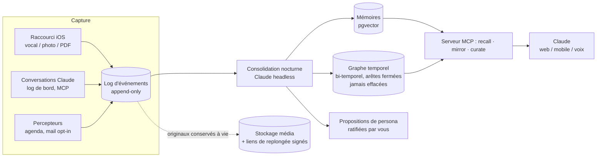

<div align="center">

# 🧠 Souvenance

**Une mémoire vivante qui vous appartient — interrogée via Claude.**

Vos conversations, vocaux, photos et notes quotidiennes deviennent une mémoire
consolidée, interrogeable, *portable* — hébergée sur votre VPS, stockée dans
des formats lisibles dans 30 ans, propulsée par le backend IA de votre choix
déjà.

[Démarrage rapide](#démarrage-rapide) · [Comment ça marche](#comment-ça-marche) ·
[Principes](#principes-appliqués-dans-le-code-pas-dans-un-pdf) · [FAQ](#faq)

</div>

---

## Pourquoi

Tous les labs d'IA construisent une mémoire de vous. Aucun ne la rendra
jamais portable — **votre contexte accumulé est leur lock-in**. Une étude
2026 des mémoires ChatGPT : 96 % créées unilatéralement par le système, la
moitié contenant des insights psychologiques. *Un profil de vous, écrit sans
vous, chez quelqu'un d'autre.*

Pendant ce temps, l'intelligence frontier devient une commodité. Ce qui prend
de la valeur, c'est votre contexte : ce que vous avez décidé, cru, comment
vous avez changé. **Le compute se loue. Le contexte se possède.**

Souvenance est la contre-position : un moteur de mémoire ouvert, auto-hébergé,
où l'IA est un adaptateur remplaçable et la mémoire est à vous — auditable,
exportable, gouvernée par vous.

## Ce que vous obtenez

- **Capturer sans effort** — un raccourci iOS (feuille de partage) : deux taps
  et ce vocal WhatsApp, cette photo ou ce PDF est archivé pour toujours,
  transcrit mot à mot pendant la nuit. Un log de bord vocal de 2 minutes.
  Des percepteurs qui tirent discrètement votre agenda personnel. *La mémoire
  n'est jamais une tâche — elle est le sous-produit d'outils utiles.*
- **Interroger votre passé** — depuis claude.ai, mobile ou voix : *« Qu'est-ce
  que je pensais de X l'an dernier ? »* Recherche hybride : vecteurs + graphe
  de connaissances temporel + cadre temporel calculé (« il y a 14 mois, deux
  étés en arrière »).
- **Revivre, pas seulement se souvenir** — `recall` renvoie la synthèse *et*
  un lien signé temporaire vers l'audio original : un tap, et vous entendez
  votre propre voix de ce matin-là, doutes compris. Une web app timeline pour
  tout parcourir.
- **Une mémoire qui dort** — consolidation nocturne (extraction, scoring
  d'importance, détection de contradictions, oubli actif) et recombinaison
  hebdomadaire type REM entre domaines de vie. Sur un **log d'événements
  append-only** : un meilleur moteur en 2028 pourra relire toute votre vie.
- **Une identité narrative dont vous êtes l'auteur** — le compilateur de
  persona rédige votre histoire (chapitres, thèmes, tensions assumées),
  chaque affirmation pesée et sourcée. Rien n'entre en vigueur sans votre
  ratification. Versionné dans Git.
- **Un miroir, jamais un oracle** — à la demande, et seulement à la demande :
  *« Que disent mes six derniers mois de mes priorités ? »* Le système
  rapporte ; il ne juge pas, ne prescrit rien, et vous rend la conclusion.
- **Mesuré, pas supposé** — un harnais de fidélité interroge votre jumeau en
  aveugle contre sa propre mémoire et le score par domaine de vie. La
  confiance se gradue par la mesure, jamais par le temps.

## Comment ça marche



Une seule base PostgreSQL (pgvector inclus). Pas de base graphe, pas de base
vectorielle, pas de queue — ennuyeux, éprouvé, durable 20 ans.

## Principes, appliqués dans le code (pas dans un PDF)

| Principe | Application |
|---|---|
| **Règle du silence** — le système n'invite jamais à revenir | Aucun canal de notification n'existe ; le gouverneur refuse toute action sortante |
| **Passé append-only** | Trigger SQL : `UPDATE`/`DELETE` impossibles sur le log |
| **Originaux à vie** | Les fichiers ne sont jamais modifiés ; le transcript n'est qu'une fiche |
| **Périmètre d'exclusion** | `constitution.yaml` filtre l'ingestion ; chaque refus est audité |
| **Règle des tiers** | Les conversations intimes des autres : synthèse, jamais verbatim ; le canal prime sur l'empreinte vocale |
| **Vous êtes l'auteur de votre identité** | Le persona n'est jamais auto-ratifié |
| **Pause, jamais perte** | Si la couche IA casse, les events s'accumulent ; la consolidation rattrape |

## Démarrage rapide

Prérequis : un VPS Linux (2 vCPU / 4 Go pour le cœur — dimensionnez selon
les briques locales activées), Docker, Python ≥ 3.11, un domaine,
et un backend d'IA au choix : CLI Claude, clé API, ou n'importe quel modèle
open source via Ollama (self-hosted intégral).

```bash
git clone https://github.com/VOTRE_ORG/pensine /opt/pensine && cd /opt/pensine
./install.sh --with-local
```

L'installeur génère les secrets, lance Postgres, applique migrations et tests,
installe les services systemd. Ensuite : connecteur MCP dans claude.ai et
raccourci iOS — le guide complet est dans
[`docs/kit-installation.md`](docs/kit-installation.md), écrit pour que vous
puissiez coller ce repo dans Claude Code et dire simplement **« installe »**.

## Coût de fonctionnement

**~0 €** au-delà de votre VPS — la couche IA utilise l'accès que vous avez
déjà, ou tourne entièrement en local avec Ollama.
L'adaptateur compute accepte aussi une clé API, changeable à tout moment.

## En quoi c'est différent de…

- **La mémoire native ChatGPT / Claude** — la leur : opaque, non portable,
  non auditable. Souvenance : le dump SQL *est* l'export, et l'adaptateur
  supprime le lock-in modèle.
- **StoryWorth / HereAfter / apps legacy** — de la mémoire *pour les autres,
  après vous*. Souvenance : de la mémoire *pour vous, vivante* — et qui devient
  quand même une autobiographie dynamique : votre voix d'alors, avant que le
  vous-futur ne réécrive le passé.
- **Les frameworks d'agents avec mémoire greffée** — Souvenance est
  mémoire-d'abord : aucune action sortante en v1, par constitution.
  L'archive est le produit.

## FAQ

**Est-ce que je parle « à un jumeau » ?** Non. Vous parlez à Claude —
l'interlocuteur reste vivant et interchangeable. Souvenance est l'arrière-boutique.

**Et si j'arrête de payer Claude ?** La capture ne dépend jamais de la couche
IA. Les events s'accumulent ; la consolidation reprend quand le compute
revient. Le pire scénario est une pause, jamais une perte.

**Et mes données à ma mort ?** Un template de clauses testamentaires est
fourni : extinction, mémorial en lecture seule, ou legs différé — décidé à
froid, à l'avance, par vous.

**Pourquoi les premières semaines semblent-elles modestes ?** Parce que la
valeur est composée : quasi nulle à 6 mois, considérable à 10 ans.
L'interview fondatrice (4 sessions scriptées) amorce le corpus dès le
premier jour.

## Licence

*À finaliser avant la publication.*

---

<div align="center">
<sub>Profond quand on vient. Silencieux quand on part.<br>
La cloche du monastère, pas le vif d'or.</sub>
</div>
