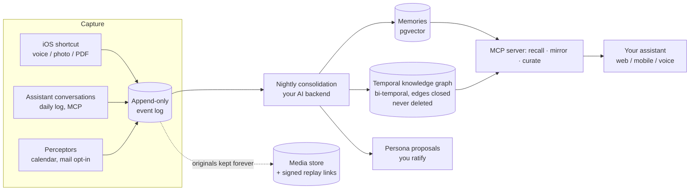

<div align="center">

# Souvenance

**A living memory you own — queried through your AI.**

Your conversations, voice memos, photos and daily notes become a consolidated,
searchable, *portable* memory — hosted on your VPS, stored in formats that will
still open in 30 years, powered by the AI subscription you already pay for.

[Quick start](#quick-start) · [How it works](#how-it-works) ·
[Principles](#principles-enforced-in-code-not-in-a-pdf) · [FAQ](#faq)

<!-- badges: CI · license · demo GIF here -->
<!--  -->

</div>

---

## Why

Every AI lab is building memory for you. None of them will ever make it
portable — **your accumulated context is their lock-in**. A 2026 study of
ChatGPT memories found 96% were created unilaterally by the system, half of
them containing psychological insights: *a profile of you, written without
you, owned by someone else.*

Meanwhile, frontier intelligence is becoming a commodity. What compounds in
value is your context: what you decided, what you believed, how you changed.
**Compute is rented. Context should be owned.**

Souvenance is the counter-position: an open, self-hosted memory engine where
the AI is a replaceable adapter and the memory is yours — auditable,
exportable, governed by you.

## What you get

- **Capture without effort** — an iOS share-sheet shortcut: two taps and that
  WhatsApp voice note, photo or PDF is archived forever, transcribed
  word-aligned overnight. A 2-minute daily voice log. Perceptors that quietly
  pull your personal calendar. *Memory is never a chore — it is the byproduct
  of tools you use because they are useful.*
- **Ask your past anything** — from any MCP client, web, mobile or voice:
  *"What did I think about X last year?"* Hybrid recall: vectors + a temporal
  knowledge graph + computed time framing ("14 months ago, two summers back").
- **Relive, not just remember** — `recall` returns the summary *and* a
  temporary signed link to the original audio: one tap, and you hear your own
  voice from that morning, doubts included. A timeline web app to browse it all.
- **A memory that sleeps** — nightly consolidation (extraction, importance
  scoring, contradiction detection, active forgetting) and weekly REM-style
  recombination across life domains. Built on an **append-only event log**:
  a better consolidation engine in 2028 can re-read your whole life.
- **A narrative identity you author** — the persona compiler drafts your story
  (chapters, themes, owned tensions), every claim weighted and sourced. It
  never takes effect until *you* ratify it. Versioned in Git.
- **A mirror, never an oracle** — on demand, and only on demand: *"What do my
  last six months say about my priorities?"* The system reports; it never
  judges, never prescribes, and always hands the conclusion back to you.
- **Measured, not assumed** — a fidelity harness quizzes your twin blind
  against its own memory and scores it by life domain. Trust is graduated by
  measurement, never by time.

## How it works



One PostgreSQL database (pgvector included). No graph database, no vector
database, no queue — boring, proven, durable for 20 years.

## Principles, enforced in code (not in a PDF)

| Principle | Enforcement |
|---|---|
| **The silence rule** — it never invites you back | No notification channel exists; the constitutional governor rejects any outbound action |
| **Append-only past** | SQL trigger: `UPDATE`/`DELETE` on the event log are impossible |
| **Originals forever** | Media files are never modified; transcripts are just catalog cards |
| **Exclusion perimeter** | `constitution.yaml` filters ingestion; every rejection is audit-logged |
| **Third-party rule** | Others' private conversations are synthesized, never archived verbatim; channel metadata beats voice-ID |
| **You author your identity** | Persona proposals are never auto-ratified |
| **Pause, never loss** | If the AI layer breaks, events keep accumulating; consolidation catches up on recovery |

## Quick start

Requirements: a Linux VPS (2 vCPU / 4 GB runs the core; size up for the
local bricks you enable), Docker, Python ≥ 3.11, a domain, and an AI backend
of your choice: Claude CLI, an API key, or any open-source model via Ollama.

```bash
git clone https://github.com/YOUR_ORG/pensine /opt/pensine && cd /opt/pensine
./install.sh --with-local
```

The installer generates secrets, starts Postgres, runs migrations and tests,
and installs systemd services. From there you are in known self-hosting
territory: wire your reverse proxy (`deploy/Caddyfile.example`), point your
MCP client at `/mcp`, configure `.env`, build the iOS shortcuts against
`/deposit` and `/log`. The guided, illustrated, AI-first walkthrough is what
the kit is for.

## The turnkey kit ($69, one-time)

The engine above is free, complete, and stays that way. What the [kit](https://souvenance.lemonsqueezy.com/checkout/buy/80bd8100-6e46-4f43-b423-1619b6e3836f)
adds is everything *around* the code that turns an afternoon of self-hosting
into a 15-minute install:

- **The full install walkthrough** — illustrated, step-by-step, written to be
  followed by your AI: paste the folder into your coding agent, say
  *"install it"*, answer a few questions. Reverse-proxy recipes (including
  the proxy-in-Docker case), connector auth options, troubleshooting table
  built from real installs.
- **iOS shortcuts, ready to import** — the two capture shortcuts (deposit +
  daily log with editable dictation review), plus the step-by-step build
  guide with every pitfall documented.
- **A versioned, tested release** — pinned dependencies, known-good
  combination, free re-downloads as new versions ship.

One-time payment, instant delivery, no subscription. You pay for the guided
path — and you fund the project.

## What's inside

| Concern | Choice | Why |
|---|---|---|
| Single database | PostgreSQL + pgvector | Event log + vectors + graph + transactions, in one place |
| Transcription | WhisperX (word-aligned) | The one capability chat assistants lack; excellent multilingual |
| Speaker ID | pyannote + ECAPA voiceprints | Enrollment is an explicit act; channel metadata always wins |
| Embeddings | nomic-embed (default, ~500 MB) or BGE-M3 (~2 GB), local CPU | Fits small VPSes; switch backends anytime with `scripts/reembed.py`; degrades to full-text if absent |
| Documents | Docling | Best PDF → structure available |
| Compute | **Adapter**: Claude CLI (your subscription) / API / anything | Swap anytime — flexibility *and* resilience |
| Protocol | MCP | Survives model and interface changes |
| Orchestration | cron + Python | Two nightly pipelines don't need Temporal |

**Running cost: ~$0** beyond your VPS — the AI layer uses whatever access you already have, or runs fully local with Ollama.

## How is this different from…

- **ChatGPT / Claude native memory** — theirs, opaque, non-portable, non-auditable.
  Souvenance is yours: SQL dump *is* the export, and the adapter means no model lock-in.
- **StoryWorth / HereAfter / legacy apps** — memory *for others, after you*.
  Souvenance is memory *for you, alive*: you query it daily, and it still becomes
  a dynamic autobiography — your voice at the time, before your future self
  rewrites the past.
- **Agent frameworks with memory bolted on** — Souvenance is memory-first:
  no outbound actions at all in v1, by constitution. The archive is the product.

## Roadmap

- [x] Append-only event sourcing, nightly + REM consolidation, active forgetting
- [x] Multimodal Pensieve: shortcut → WhisperX / vision / EXIF / Docling, replay links
- [x] Temporal knowledge graph (bi-temporal, contradicted edges closed, never deleted)
- [x] Voiceprint enrollment + diarization
- [x] Timeline web app, mirror, persona compiler + ratification, fidelity harness
- [ ] Prediction-error loop (drafts in your style, learning only from the delta)
- [ ] Governed outbound actions (graduated autonomy, unlocked by fidelity scores)
- [ ] Public benchmark run (LoCoMo)

## FAQ

**Do I talk to "a twin"?** No. You talk to your assistant — the interlocutor stays
alive and replaceable. Souvenance is the back room.

**What if I stop paying for an AI subscription?** Capture never depends on the AI layer.
Events accumulate; consolidation resumes when compute returns — with your
subscription, an API key, or a local model behind the adapter. Worst case is
a pause, never a loss.

**What about my data when I die?** A testament template ships with the kit:
extinction, read-only memorial, or delayed legacy — decided calmly, in
advance, by you.

**Why should the first weeks feel underwhelming?** Because compound value is
the point: near-zero at 6 months, considerable at 10 years. The founding
interview (a scripted 4-session bootstrap) seeds the corpus on day one.

## License

MIT — see [LICENSE](LICENSE).

---

<div align="center">
<sub>Deep when you come. Silent when you leave.<br>
The monastery bell, not the golden snitch.</sub>
</div>
